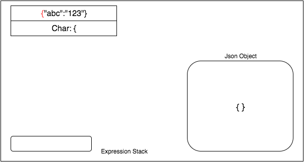

KwhonJson - a json library in only standard C
===

The goal of this project is to create a simple json library in c, without any dependencies on other open source libraries but just standard C. It should be good for developers who want to have minimal use of json parser. The json library should allow programmer to create/modify json model to ease their development. The simpliest case would be to accept a json file to read/manipulate certain key values inside the json object. 

I didn't look at how other developers implemented their own json c library. so I just come up with methods to implement json parser. The methodology is a stack based turing machine to accept characters from string, and alter the "tape state" when it recognizes certain pattern of the string. I suppose it is the working principle of many regular expression parsers. Please note that the standard json format speecification is stated in http://www.json.org/ . The project may not follow exactly the specification.



The flow of parsing

Usage
---

#### get Set Json Object
```c
...
    JsonObject* content = MakeJsonObject();
    JsonSet(&content,"name",JSTRING,JsonString("alvin"));
    JsonSet(&content,"id",JSTRING,JsonString("111"));
    JsonSet(&content,"age",JINTEGER,JsonInteger(25));
    JsonObject* info = MakeJsonObject();
    JsonSet(&info,"mobile",JSTRING, JsonString("123456"));
    JsonSet(&content,"info",JSONOBJ,info);
    JsonArray* jarr = MakeJArray();
    JsonAdd(&jarr,"food",JSTRING,JsonString("apple"));
    JsonAdd(&jarr,"drink",JSTRING,JsonString("water"));
    JsonObject* friend = MakeJsonObject();
    JsonSet(&friend,"name",JSTRING, JsonString("jon"));
    JsonAdd(&jarr,"friend",JSONOBJ,friend);
    JsonSet(&content,"records",JSONARR,jarr);
    
    JsonObjectPrint(content);
    
    JString* namej = JsonGetString(&content,"info/mobile");
    if(namej != NULL)
        printf("get %.*s\n",namej->len,namej->str);
    
    
    FreeJsonObject(&content);
...
```

output
```
{"name":"alvin","id":"111","age":25,"info":{"mobile":"123456"},"records":["food":"apple","drink":"water","friend":{"name":"jon"}]}
get 123456
```


#### parse from string
```c
const char checking[] = "{\"abc\":123,\"def\":\"apple\",\"obj\":{\"aaa\":1bb,\"ty\":{\"abb\":120,\"acc\":11},\"ty2\":12},\"arr\":[\"arr1\":1234]}";
JsonObject* jsonobj = MakeJsonObject();
JsonParse(checking, strlen(checking),&jsonobj);
JsonObjectPrint(jsonobj);
FreeJsonObject(&jsonobj);
```
output
```
{"abc":123,"def":"apple","obj":{"aaa":"1bb","ty":{"abb":120,"acc":11},"ty2":12},"arr":["arr1":1234]}
```

#### parsing special cases

##### integer value should have no non-digit characters and not use single quote

```c
"{\"abc\":123}"
"{\"abc\":123b}"
"{\"abc\":\"123\"}
```
interpretation:
```
{"abc":123}
{"abc":"123b"}
{"abc":"123"}
```

##### ignoring multiple seperators

```c
"{\"abc\":123,,,,\"def\":456}"
```
interpretation:
```
{"abc":123,"def":456}
```

##### null input displays null message directly

```c
"{\"abc\":}"
"{\"abc\":,\"def\":}"
``` 
interpretation:
```
{"abc":null}
{"abc":null,"def":null}
```

Progress ( ~ 80%)
---

String, array, integer, bool and null are the only currenly supported types.

There are still some incomplete part of the library.
* json setting on specific path
* exceptional string/characters

Build
---

You could just make it
```sh
make
```
The file cjson.c contains main function.
It should output executable called cjson, and also output object files to bin directory.

or to build a library
```
make library
```
It should output kwhonjson.a file in lib folder.

To programmer do not know how to link the library to your code, simply do this:
```sh
gcc -g -Wall -c main.c -o main.o ## compile your own code to object files
gcc -g -Wall -o main.out main.o lib/kwhonjson.a
```
